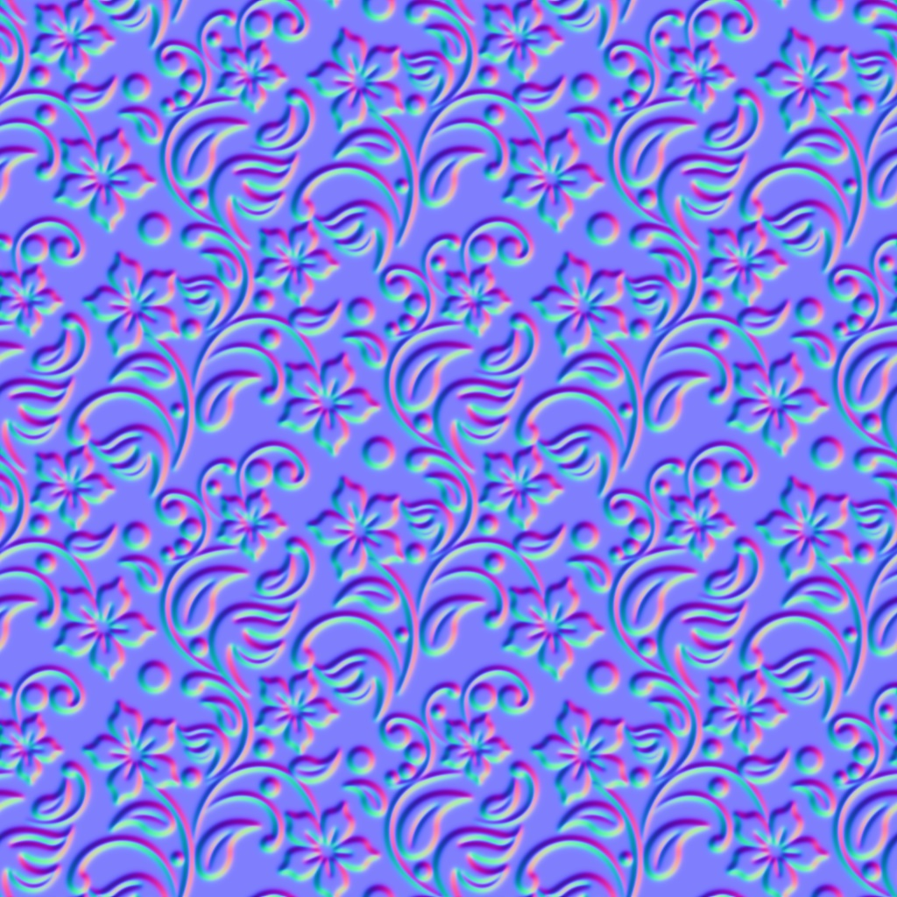

# **Materials** and **textures**

## Available materials

- `MeshNormalMaterial`:  
  - Uses **normal** vector to color faces
  - Great for debugging
- `MeshStandardMaterial`: 
  - Uses physically based rendering (PBR)
  - Same approach as in **Unity** or **Unreal** Engine
  - [s2012_pbs_disney_brdf_notes_v2.pdf](https://disney-animation.s3.amazonaws.com/library/s2012_pbs_disney_brdf_notes_v2.pdf)
- And some others...

## What does it look like

 <!-- .element height="400" -->

*[~Standard Material Properties~](../examples/meshstandard)*

## Three.js and **Textures**

- Defined as `map`-property on a material
- (Usually) square images (`.png`, `.tga`, etc.)
- Used to add details to surface:
  - `alphaMap`, `aoMap`, `bumpMap`, `displacementMap`, `emissiveMap`, `envMap`, `lightMap`, `map`, `metalnessMap`, `normalMap`, `roughnessMap` 

## **Texture** types

Interesting ones:
  - (color)`map`: Apply an image to (part of) the model
  - `normalMap`: Add fake depth to a surface
  - `alphaMap`: Set selective opacity
  - `emissiveMap`: Make parts of the model glow

## **Color** map

 <!-- .element height="400" -->

*[~Color Map Example~](../examples/core-concepts/concepts.html)*

## **Normal** map

 <!-- .element height="400" -->

*[~Normal Map Example~](../examples/normalmap)*

## **UV*-coordinates

Image of UV mapping

Should I show an example

TODO:
  - Explain UVMapping.
  - Show some code how to load this, instead of just showing the results.