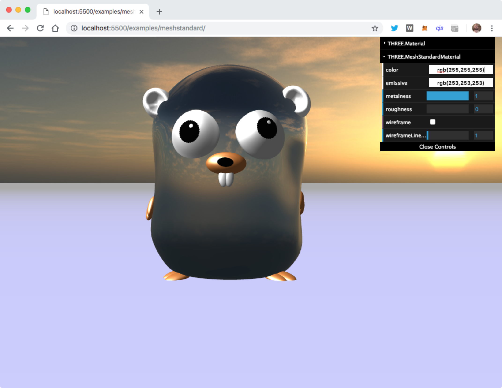
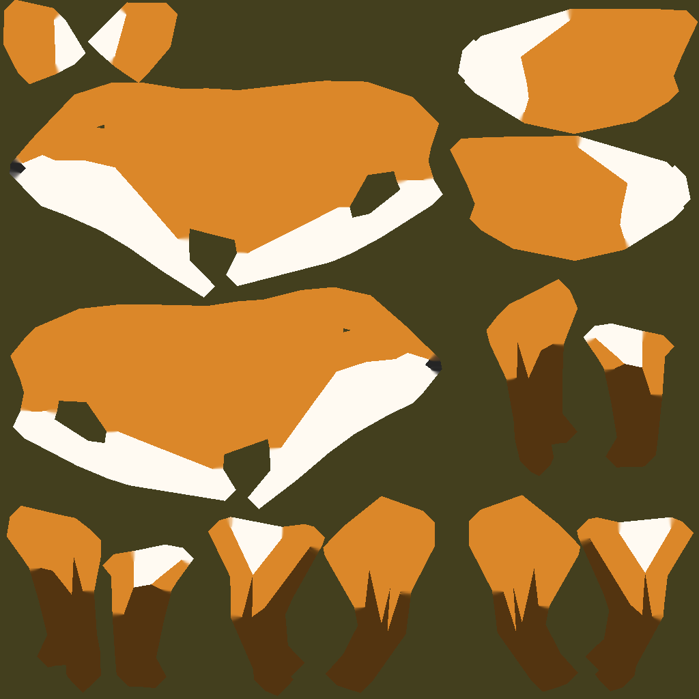
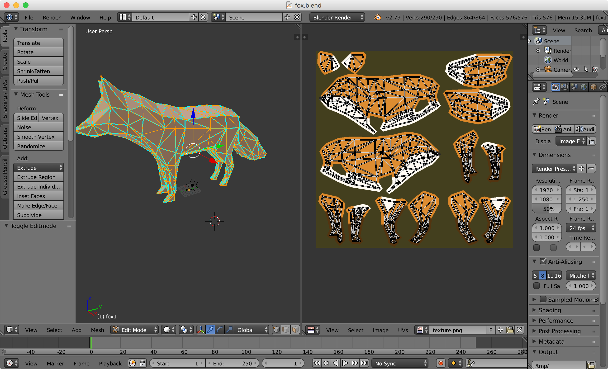
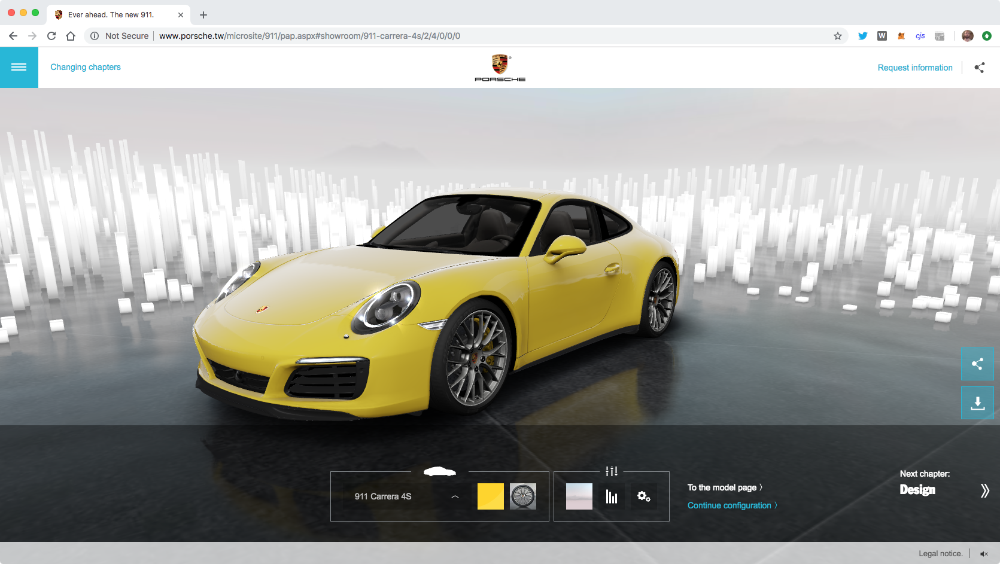

## Available **materials**

- `MeshNormalMaterial`:  
  - Uses **normal** vector to color faces
  - Great for debugging
- `MeshStandardMaterial`: 
  - Uses physically based rendering (PBR)
  - Same approach as in **Unity** or **Unreal** Engine
  - [s2012_pbs_disney_brdf_notes_v2.pdf](https://disney-animation.s3.amazonaws.com/library/s2012_pbs_disney_brdf_notes_v2.pdf)
- And some others...


## Easy to **use**...

```
var basicMaterial = new THREE.MeshStandardMaterial({...});
var geom = new THREE.MeshSphereGeometry(3, 30, 30);
var mesh1 = new THREE.Mesh(geom, basicMaterial);

var normalMaterial = new THREE.MeshNormalMaterial();
var mesh2 = new THREE.Mesh(geom, normalMaterial);

```

*~Three.js converts this to shaders~*


## What does it look like

 <!-- .element height="400" -->

*[~Standard Material Properties~](../examples/meshstandard)*


## Three.js and **Textures**

- Defined as `map`-property on a material
- (Usually) square images (`.png`, `.tga`, etc.)
- Used to add details to surface:
  - `alphaMap`, `aoMap`, `bumpMap`, `displacementMap`, `emissiveMap`, `envMap`, `lightMap`, `map`, `metalnessMap`, `normalMap`, `roughnessMap` 


## **Texture** types

Interesting ones:
  - (color)`map`: Apply an image to (part of) the model
  - `normalMap`: Add fake depth to a surface
  - `alphaMap`: Set selective opacity
  - `emissiveMap`: Make parts of the model glow


## **Color** map

 <!-- .element height="400" -->

*[~Color Map Example~](../examples/core-concepts/concepts.html)*


## **UV** mapping

 <!-- .element height="400" -->

*~Map each **face** to part of the **texture**~*


## **Normal** map

 <!-- .element height="400" -->

*[~Normal Map Example~](../examples/normalmap)*


## Loading **textures**

```
var textureLoader = new THREE.TextureLoader();

var basicMaterial = new THREE.MeshStandardMaterial();
basicMaterial.map = textureLoader.load('textures/wood.png');
basicMaterial.normalMap = textureLoader
    .load('textures/woodNormal.png');

var geom = new THREE.MeshSphereGeometry(3, 30, 30);
var mesh1 = new THREE.Mesh(geom, basicMaterial);
```

*~ asynchronously loads the materials ~*


## **Porsche** example

 <!-- .element height="450" -->

[Porsche - WebGL](http://www.porsche.tw/microsite/911/pap.aspx#showroom/911-carrera-4s/2/4/0/0/0)
