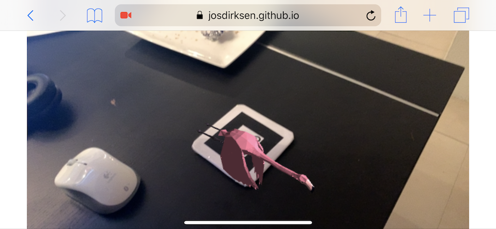
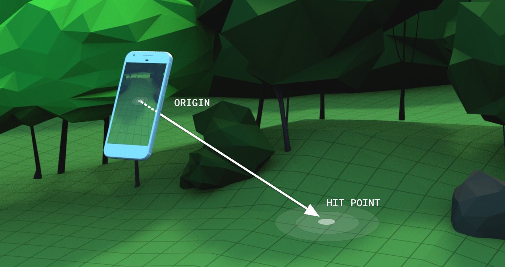

<!-- .slide: data-background-image="./images/bgs/ar_img_big.png" data-background-size="cover" -->


## **AR** with **Web-XR**

- Open standard that allows AR in browsers
  - Leverage `ARCore` or `ARKit`
- Spec: https://github.com/immersive-web/webxr
- Info and examples on: https://webxr.io/
- Minimal device support...

*Be warned: Still very much in **Alpha**!*


## Alternatively... **AR.js**

- Pure Javascript: uses `webgl` and `webrtc`
  - Runs on many browsers and devices
  - Performance varies...
- Doesn't use `ARCore` or `ARToolKit`
  - Uses `ARToolkit` compiled with `emscripten`
- https://github.com/jeromeetienne/AR.js


## **AR.JS** based example

 <!-- .element height="400" -->

[~Ar with AR.js~](../examples/arjs/)


## Minimal code changes: **part 1**

```javascript
  var arsource = new THREEx.ArToolkitSource(
    {sourceType : 'webcam'}
  )
  arsource.init(function onReady(){onResize()})
  var arToolkitContext = new THREEx.ArToolkitContext({
    cameraParametersUrl: './camera_para.dat',
    detectionMode: 'mono',
  })

  arToolkitContext.init(function onCompleted(){
    camera.projectionMatrix.copy( 
      arToolkitContext.getProjectionMatrix() );
  })
```


## Minimal code changes: **part 2**

```javascript
  // which markers do we use?
  var markerControls = new THREEx.ArMarkerControls(
    arToolkitContext, camera, {
      type : 'pattern', 
      patternUrl : './patt.hiro', 
      changeMatrixMode: 'cameraTransformMatrix'
  })

  // and in render loop
  arToolkitContext.update( arToolkitSource.domElement )

```


## **WEB-XR** based example

- **WEB-XR** provide realworld information 
  - Surfaces, objects etc.
- Use *hit test* to determine collisions
- More *real* AR than **AR.js**
 
 <!-- .element height="200" -->


## ** Web-XR ** based example

 <!-- .element height="400" -->

[~Ar with WebXR~](../examples/webarjs/)


## Not so well integrated... **yet**

- Lots of setup code
- Somewhat easier through `XRExampleBase`

```javascript
createSceneGraphNode() {
  let g = new THREE.Group();
  // create mesh and add to group
  this.meshes.push(g);
  return g;
}

doRender() {
  var delta = this.clock.getDelta();
  this.groups.forEach(group => {
    // update animations and rotations for meshes in group
  });
  super.doRender();
}
```


## Final Note on **Web-AR**

- **XRViewer**: Almost compatible with *Web-XR*
- **WebAROnARKit** and **WebAROnARCore**: 
  - iOS: Build using XCode
  - Android: Install APK manually

*~ No support (yet) on any mobile browser!*
